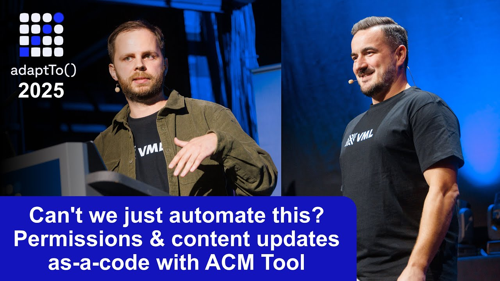
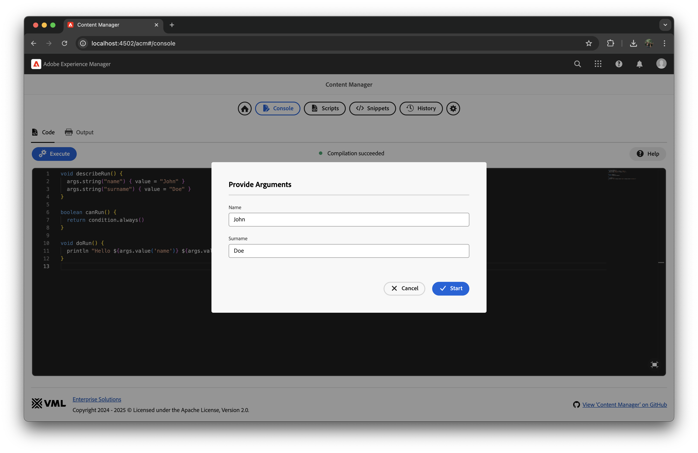
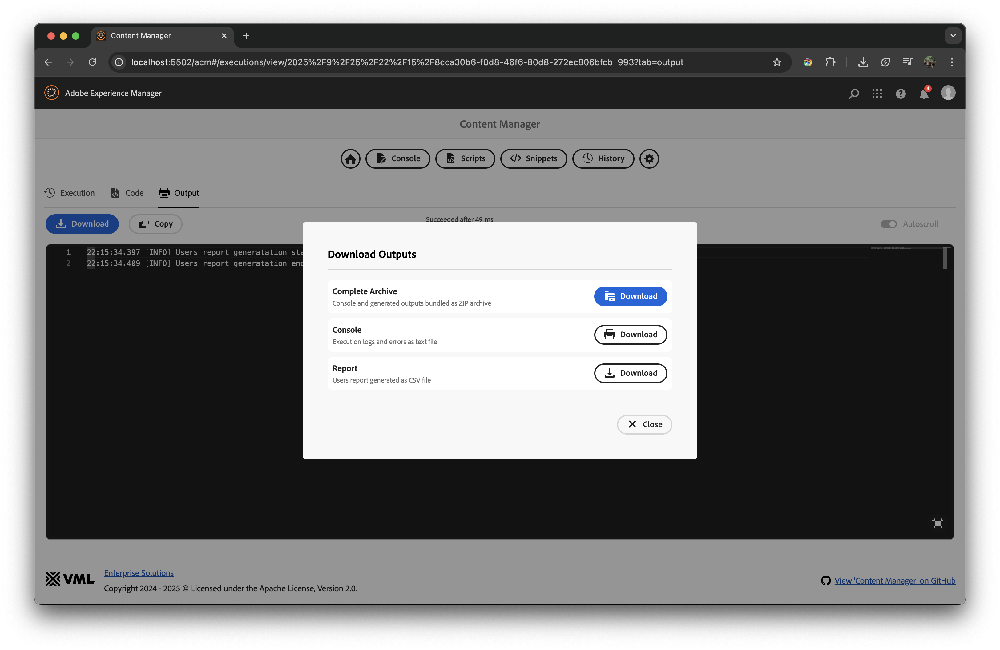
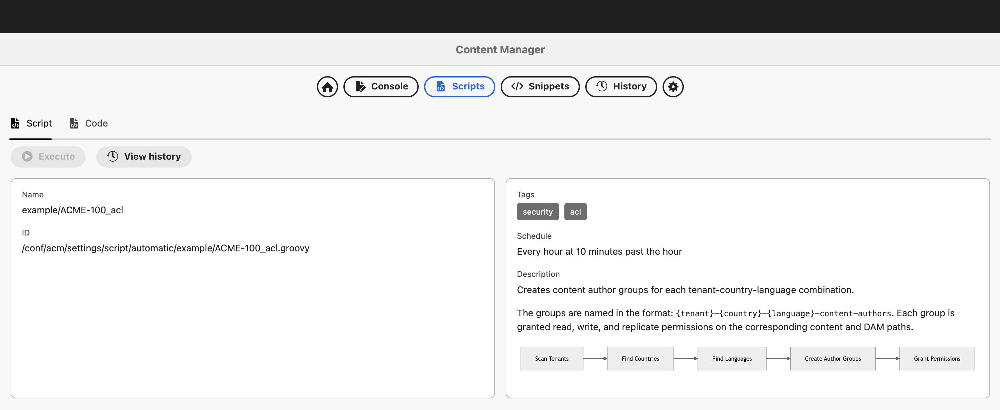

<a href="https://www.vml.com/expertise/enterprise-solutions" target="_blank">
  <picture>
    <source srcset="docs/vml-logo-white.svg" media="(prefers-color-scheme: dark)">
    
  </picture>
</a>

[](https://github.com/wttech/acm/releases)
[](https://github.com/wttech/acm/releases)
[](https://github.com/wttech/acm/actions/workflows/check.yml)
[](http://www.apache.org/licenses/)

# AEM Content Manager (ACM)

<p>
<picture>
    <source srcset="docs/acm-logo-white.svg" media="(prefers-color-scheme: dark)">
    
</picture>
</p>

**Manage permissions & content updates as code.**

ACM for Adobe Experience Manager (AEM) streamlines workflows and boosts productivity with an intuitive interface and robust features. It automates bulk content and permission changes, making it ideal for content migration and large-scale permission management. ACM offers an IDE-like experience with code completion, auto-import, and on-the-fly compilation.

It works seamlessly across AEM on-premise, AMS, and AEMaaCS environments.

## References

* Talk at AdaptTo 2025 Conference - [Can't we just automate this? Permissions & content updates as-a-code with ACM Tool](https://adapt.to/2025/schedule/cant-we-just-automate-this-permissions-and-content-updates-as-a-code-with-acm-tool) by [Krystian Panek](mailto:krystian.panek@vml.com) &amp; [Tomasz Sobczyk](mailto:tomasz.sobczyk@vml.com)

[](https://www.youtube.com/watch?v=hGcMWGE7ZiU)

## Screenshots


## Table of Contents

- [AEM Content Manager (ACM)](#aem-content-manager-acm)
  - [References](#references)
  - [Screenshots](#screenshots)
  - [Table of Contents](#table-of-contents)
  - [Key Features](#key-features)
    - [All-in-one Solution](#all-in-one-solution)
    - [New Approach](#new-approach)
    - [Content Management](#content-management)
    - [Permissions Management](#permissions-management)
    - [Data Imports \& Exports](#data-imports--exports)
  - [Installation](#installation)
    - [Package Installation](#package-installation)
    - [Tools Access Configuration](#tools-access-configuration)
      - [Feature Permissions](#feature-permissions)
      - [API Permissions](#api-permissions)
  - [Compatibility](#compatibility)
  - [Documentation](#documentation)
    - [Usage](#usage)
    - [Console](#console)
    - [Content scripts](#content-scripts)
      - [Minimal example](#minimal-example)
      - [Conditions](#conditions)
      - [Inputs example](#inputs-example)
      - [Outputs example](#outputs-example)
      - [Console \& logging](#console--logging)
        - [Simple console output](#simple-console-output)
        - [Timestamped console output](#timestamped-console-output)
        - [Logged console output](#logged-console-output)
      - [ACL example](#acl-example)
      - [Repo example](#repo-example)
      - [Abortable example](#abortable-example)
      - [Script documentation](#script-documentation)
    - [History](#history)
    - [Extension scripts](#extension-scripts)
      - [Example extension script](#example-extension-script)
    - [Snippets](#snippets)
      - [Example snippet](#example-snippet)
    - [Mocks](#mocks)
    - [Notifications](#notifications)
  - [Development](#development)
  - [Releasing](#releasing)
  - [Authors](#authors)
  - [Contributing](#contributing)
  - [License](#license)

## Key Features

### All-in-one Solution

ACM is a comprehensive alternative to tools like APM, AECU, AEM Groovy Console, and AC Tool.
It leverages the Groovy language, which is familiar to most Java developers, eliminating the need to learn custom YAML syntax or languages/grammars. 
Enjoy a single, painless tool setup in AEM (Adobe Experience Manager) projects with no hooks and POM updates.

### New Approach

Experience a different way of using Groovy scripts. 
ACM ensures the instance is healthy before scripts decide when to run: once, periodically, or at an exact date and time. 
Execute scripts in parallel or sequentially, offering unmatched flexibility and control.

### Content Management

Effortlessly migrate pages and components between versions. Ensure content integrity and resolve issues with confidence.

### Permissions Management

Apply JCR permissions dynamically. 
Manage permissions seamlessly during site creation, blueprinting, and for live copies, language copies, and other AEM-specific replication scenarios.

### Data Imports & Exports

Effortlessly integrate data from external sources into the JCR repository, enhancing content management capabilities. 
By simplifying data import implementation, ACM allows developers to focus more on developing better components and presenting data effectively, ensuring a user-friendly experience.

## Installation

### Package Installation

The ready-to-install AEM packages are available on:

- [GitHub releases](https://github.com/wttech/acm/releases).
- [Maven Central](https://central.sonatype.com/search?q=dev.vml.es.acm).

There are two ways to install AEM Content Manager on your AEM (Adobe Experience Manager) instances:

1. **Using the 'all' package:**
    * Recommended for fresh AEM instances.
    * This package will also install Groovy Bundles ([groovy](https://mvnrepository.com/artifact/org.apache.groovy/groovy) and [groovy-templates](https://mvnrepository.com/artifact/org.apache.groovy/groovy-templates)).
2. **Using the 'minimal' package:**
    * Recommended for AEM instances that already contain some dependencies shared with other tools.
    * This package does not include Groovy bundles, which can be provided by other tools like [AEM Easy Content Upgrade](https://github.com/valtech/aem-easy-content-upgrade/releases) (AECU) or [AEM Groovy Console](https://github.com/orbinson/aem-groovy-console/releases).

For AEM On-Premise and AEM Managed Service (AMS) deployments, just install the ACM package using the AEM Package Manager.

:construction: Restart required: Basic ACLs and paths are created via [repo-init](https://sling.apache.org/documentation/bundles/repository-initialization.html) [script](https://github.com/wttech/acm/blob/main/ui.config/src/main/content/jcr_root/apps/acm-config/osgiconfig/config/org.apache.sling.jcr.repoinit.RepositoryInitializer~acmcore.config) after installing the ACM package. A reboot is strongly recommended, as the health checker may block code execution until the restart is complete. :construction:

For AEMaaCS deployments, embed the ACM package as a part of project-specific 'all' package like other vendor packages in the [AEM Project Archetype](https://github.com/adobe/aem-project-archetype/blob/develop/src/main/archetype/all/pom.xml):

Adjust file 'all/pom.xml':

1. Add dependency to [all](https://central.sonatype.com/artifact/dev.vml.es/acm.all) or [min](https://central.sonatype.com/artifact/dev.vml.es/acm.min) package in the *dependencies* section:

    ```xml
    <dependency>
        <groupId>dev.vml.es</groupId>
        <artifactId>acm.all</artifactId>
        <version>${acm.version}</version>
        <type>zip</type>
    </dependency>
    ```

2. Add embedding in *filevault-package-maven-plugin* configuration:

    ```xml
    <embedded>
        <groupId>dev.vml.es</groupId>
        <artifactId>acm.all</artifactId>
        <type>zip</type>
        <target>/apps/${appId}-vendor-packages/application/install</target>
    </embedded>
    ```

    Remember to replace `${acm.version}` and `${appId}` with the actual values.

    Repeat the same for [ui.content.example](https://central.sonatype.com/artifact/dev.vml.es/acm.ui.content.example) package if you want to install demonstrative ACM scripts to get you started quickly.

### Tools Access Configuration

The default settings are defined in the [repo init OSGi config](https://github.com/wttech/acm/blob/main/ui.config/src/main/content/jcr_root/apps/acm-config/osgiconfig/config/org.apache.sling.jcr.repoinit.RepositoryInitializer~acmcore.config), which effectively restrict access to the tool and script execution to administrators only - a recommended practice for production environments.

If you require further customization, you can create your own repo init OSGi config to override or extend the default configuration.

#### Feature Permissions

ACM supports fine-grained permission control through individual features. This allows you to grant specific capabilities to different user groups without providing full access to ACM tool. For a complete list of available features, see the [ACM features directory](https://github.com/wttech/acm/tree/main/ui.apps/src/main/content/jcr_root/apps/acm/feature).

**Example: Create groups for full and limited access:**

```ini
service.ranking=I"100"
scripts=["  
    set ACL for everyone
        deny jcr:read on /apps/cq/core/content/nav/tools/acm
        deny jcr:read on /apps/acm
    end

    create group acm-admins
    set ACL for acm-admins
        allow jcr:read on /apps/cq/core/content/nav/tools/acm
        allow jcr:read on /apps/acm
    end

    create group acm-script-users
    set ACL for acm-script-users
        allow jcr:read on /apps/cq/core/content/nav/tools/acm
        allow jcr:read on /apps/acm/gui
        allow jcr:read on /apps/acm/api

        allow jcr:read on /apps/acm/feature/script/list
        allow jcr:read on /apps/acm/feature/script/view
        allow jcr:read on /apps/acm/feature/execution/view

        allow jcr:read on /conf/acm/settings/script
    end
"]
```

Later on when AEM is running, just assign users to the created groups (`acm-admins` or `acm-script-users`) to grant them the corresponding access.

#### API Permissions

Access to ACM's REST API endpoints is controlled through nodes under `/apps/acm/api`. For a complete list of available endpoints, see the [ACM API directory](https://github.com/wttech/acm/tree/main/ui.apps/src/main/content/jcr_root/apps/acm/api).

**Important:** Code execution requires authorization at three levels: API endpoint, feature, and e.g. script path. Example:

```ini
set ACL for acm-automation-user
    allow jcr:read on /apps/acm/api
    allow jcr:read on /apps/acm/feature
    allow jcr:read on /conf/acm/settings/script
end
```

## Compatibility

| AEM Content Manager | AEM           | Java      | Groovy  |
| ------------------- | ------------- | --------- | ------- |
| 1.0.0+              | 6.5.0+, cloud | 8, 11, 21 | 4.0.22+ |

Such a wide range of compatibility was designed to allow using the tool as a part of the AEM upgrade process, where different AEM and Java versions are involved.

The tool is compatible with almost all AEM versions, starting from on-premise 6.5.0, including the most recent AEMaaCS (AEM as a Cloud Service) version.
Also has been tested across various Java versions, including 8, 11, and the latest 21.
Groovy version 4.0.22+ is used, which is compatible with all mentioned Java versions.

Note that AEM Content Manager is using Groovy scripts concept. However, it is **not** using [AEM Groovy Console](https://github.com/icfnext/aem-groovy-console). It is done intentionally, because Groovy Console has close dependencies to concrete AEM version.
AEM Content Manager tool is implemented in a AEM version agnostic way, to make it more universal and more fault-tolerant when AEM version is changing.

## Documentation

### Usage

The ACM tool helps developers to implement Groovy scripts in AEM projects.
Groovy code need to at first implemented and tested then persisted in the AEM instance for later deployment.
To achieve that, ACM provides a set of features to help you with the development process.

**Groovy code can be run in three ways:**

1. **Ad-hoc using 'Console'**
   - Code executed in the console is run in the context of the currently logged user to AEM.

2. **Manually executed scripts**
   - Navigate to the 'Scripts' page and select the 'Manual' tab.
   - Code executed here also runs in the context of the current user.

3. **Automatically executed scripts**
   - Navigate to the 'Scripts' page and select the 'Automatic' tab.
   - Code can be scheduled to run once, periodically, or at an exact date and time. Runs in the context of the system user or impersonated user set in the configuration.

**Rules for executing Groovy code:**

- **Context**: Code can leverage any Java code deployed in the AEM instance as OSGi bundles, including project code.
- **Health Checks**: ACM performs health checks to ensure the instance is stable before executing scripts. These checks include:
  - OSGi bundles (with the ability to exclude some to address known issues)
  - OSGi events occurrence indicating temporal instability
  - JCR repository paths presence (e.g., `/content/acme`, `/content/dam/acme`)

### Console

The ACM Console is interactive and offers the following features:

- Execute just-in-time Groovy code.
- Review the output of the code in real-time.
- View compilation errors as you type.
- Access a list of available variables and methods.
- Utilize code completion assistance for OSGi classes, JCR paths, etc.
- Quickly insert code templates using snippets.


### Content scripts

Content scripts in ACM are Groovy scripts that can be used to automate various tasks in AEM. 
These scripts can be placed in specific locations within the AEM repository to control their execution behavior.

- `/conf/acm/settings/script/automatic/{project}`: Automatically executed scripts on instance boot (usually run once after deployment) or on scheduled intervals defined by `scheduleRun()` method. Specific conditions could be narrowed by `canRun()` method.
- `/conf/acm/settings/script/manual/{project}`: Manually executed scripts (usually with inputs), run under specific circumstances by platform administrators.

#### Minimal example

Below is a minimal example of a Groovy script that prints "Hello World!" to the console.

```groovy
boolean canRun() {
    return conditions.always()
}

void doRun() {
    println "Hello World!"
}
```

The `canRun()` method is used to determine if the script should be executed.
The `doRun()` method contains the actual code to be executed.

Notice that the script on their own decide when to run without a need to specify any additional metadata. In that way the-sky-is-the-limit. You can run the script once, periodically, or at an exact date and time.
There are many built-in, ready-to-use conditions available in the `conditions` [service](https://github.com/wttech/acm/blob/main/core/src/main/java/dev/vml/es/acm/core/code/Conditions.java).

#### Conditions

Conditions determine when automatic scripts should execute. The `conditions` [service](https://github.com/wttech/acm/blob/main/core/src/main/java/dev/vml/es/acm/core/code/Conditions.java) provides many useful methods:

- `conditions.always()` - Always execute on every trigger. Most commonly used in console and manual scripts where execution is triggered directly by users.
- `conditions.never()` - Never execute. Useful for temporarily disabling scripts.
- `conditions.changed()` - Execute when script content changed or when instance changed after a failure. Automatically retries failed executions after deployments, making it more suitable for production scenarios than `once()`.
- `conditions.contentChanged()` - Execute when script content changed or when never executed before. Does not consider instance state changes.
- `conditions.instanceChanged()` - Execute when instance state changed (OSGi bundle checksums changed or ACM bundle restarted). Useful for detecting deployments or restarts.
- `conditions.retryIfInstanceChanged()` - Execute when instance state changed and previous execution failed. Combines instance change detection with failure retry logic.
- `conditions.once()` - Execute only once, when never executed before. Does not automatically retry after failures. Works well for initialization scripts that should not be repeated.
- `conditions.notSucceeded()` - Execute if previous execution wasn't successful. Retries execution until it succeeds, ignoring script content and instance state changes.
- `conditions.isInstanceAuthor()` / `conditions.isInstancePublish()` - Execute only on specific instance types (author or publish).
- `conditions.isInstanceRunMode("dev")` - Execute only when instance has specific run mode.
- `conditions.isInstanceOnPrem()` - Execute only on on-premise AEM instances.
- `conditions.isInstanceCloud()` - Execute only on cloud-based AEM instances (AEMaaCS).
- `conditions.isInstanceCloudSdk()` - Execute only on AEM Cloud SDK (local development environment).
- `conditions.isInstanceCloudContainer()` - Execute only on AEM Cloud Service containers (non-SDK cloud instances).

**Example usage:**

```groovy
boolean canRun() {
    return conditions.once()
}

void doRun() {
    out.info "Removing deprecated properties from pages..."
    repo.get("/content/acme").query("n.[sling:resourceType=acme/component/page]").each { page ->
        page.removeProperty("deprecatedProperty")
    }
    out.success "Removed deprecated properties successfully."
}
```

For the complete list of available conditions and their behavior, see the [Conditions.java source code](https://github.com/wttech/acm/blob/main/core/src/main/java/dev/vml/es/acm/core/code/Conditions.java).

#### Inputs example

Scripts could accept inputs, which are passed to the script when it is executed.

```groovy
void describeRun() {
    inputs.string("name") { value = "John" }
    inputs.string("surname") { value = "Doe" }
}

boolean canRun() {
    return conditions.always()
}

void doRun() {
    println "Hello ${inputs.value('name')} ${inputs.value('surname')}!"
}
```

The `describeRun()` method is used to define the inputs that can be passed to the script.
The `inputs` service is used to define the inputs that can be passed to the script.
When the script is executed, the inputs are passed to the `doRun()` method.

There are many built-in input types to use handling different types of data like string, boolean, number, date, file, etc. Just check `inputs` [service](https://github.com/wttech/acm/blob/main/core/src/main/java/dev/vml/es/acm/core/code/Inputs.java) for more details.



Be inspired by reviewing examples like [page thumbnail script](https://github.com/wttech/acm/blob/main/ui.content.example/src/main/content/jcr_root/conf/acm/settings/script/manual/example/ACME-202_page-thumbnail.groovy) which allows user to upload a thumbnail image and set it as a page thumbnail with only a few clicks and a few lines of code.

#### Outputs example

Scripts can generate output files that can be downloaded after execution.

The following example of the content script demonstrates how to generate a CSV report as an output file using the `outputs` [service](https://github.com/wttech/acm/blob/main/core/src/main/java/dev/vml/es/acm/core/code/Outputs.java).

There is no limitation on the number of output files that can be generated by a script. Each output file can have its own label, description, and download name. All outputs are persisted in the history, allowing you to review and download them later.

```groovy
boolean canRun() {
    return conditions.always()
}

void doRun() { 
    log.info "Users report generation started"

    def report = outputs.file("report") {
        label = "Report"
        description = "Users report generated as CSV file"
        downloadName = "report.csv"
    }

    def users = [
        [name: "John", surname: "Doe", birth: "1991"],
        [name: "Jane", surname: "Doe", birth: "1995"],
        [name: "Jack", surname: "Smith", birth: "1988"]
    ] 
    for (def user : users) {
        report.out.println("${user.name},${user.surname},${user.birth}")
    }

    log.info "Users report generation ended successfully"
}
```



There is also available text output type, which allows you to generate markdown or any text with syntax highlighting (JSON, XML, YAML, etc.). This may be useful to allow users to quickly open links to e.g. just created pages, copy-paste generated configuration and use it somewhere else.

```groovy
outputs.text("summary") { 
    label = "Summary"
    value = """
    - Total Users: ${totalUsers}
    - Active Users: ${activeUsers}
    - Inactive Users: ${inactiveUsers}
    - Generated At: ${new Date()}
    """.stripIndent().trim()
}

outputs.text("configJson") { 
    label = "Configuration"
    value = '''
    {
        "setting1": true,
        "setting2": "value",
        "setting3": 10
    }
    '''.stripIndent().trim()
    language = "json"
}
```

#### Console & logging

Scripts provide three different ways to write messages to the console and logs, each serving different purposes:

##### Simple console output

Use `println` or `printf` for simple console output without timestamps or log levels. This is useful for quick debugging or generating simple text output.

```groovy
void doRun() {
    println "Simple message without timestamp"
    printf "Formatted: %s = %d\n", "count", 42
}
```

##### Timestamped console output

Use `out.error()`, `out.warn()`, `out.success()`, `out.info()`, `out.debug()` to write messages to the console with timestamps and log levels. These messages appear only in the execution console and are not persisted to AEM logs.

```groovy
void doRun() {
    out.error "Failed to process resource: ${resource.path}"
    out.warn "Resource ${resource.path} is missing required property"
    out.success "Resource ${resource.path} processed successfully"
    out.info "Processing started"
}
```

##### Logged console output

Use `log.error()`, `log.warn()`, `log.info()`, `log.debug()`, `log.trace()` to write messages both to the console and to AEM logs (e.g., error.log). This is recommended for production scripts where you need persistent log records.

```groovy
void doRun() {
    log.info "Doing regular stuff"
    
    try {
        // ... risky logic
        log.info "Doing risky stuff ended"
    } catch (Exception e) {
        log.error "Doing risky stuff failed: ${e.message}", e
    }
}
```

**Best practices:**

- Use `println` / `printf` for quick debugging or simple text generation
- Use `out.*` for console-only feedback during script execution (progress indicators, status updates)
- Use `log.*` for important events that should be persisted in AEM logs (errors, warnings, critical operations)

#### ACL example

The following example of the automatic script demonstrates how to create a user and a group, assign permissions, and add members to the group using the [ACL service](https://github.com/wttech/acm/blob/main/core/src/main/java/dev/vml/es/acm/core/acl/Acl.java) (`acl`).

```groovy
def scheduleRun() {
    return schedules.cron("0 10 * ? * * *") // every hour at minute 10
}

boolean canRun() {
    return conditions.always()
}

void doRun() {
    log.info "ACL setup started"

    def acmeService = acl.createUser { id = "acme.service"; systemUser(); skipIfExists() }.tap {
        // purge()
        allow { path = "/content"; permissions = ["jcr:read", "jcr:write"] }
    }
    def johnDoe = acl.createUser { id = "john.doe"; fullName = "John Doe"; password = "ilovekittens"; skipIfExists() }.tap {
        // purge()
        allow("/content", ["jcr:read"])
    }
    acl.createGroup { id = "test.group" }.tap {
        // removeAllMembers()
        addMember(acmeService)
        addMember(johnDoe)
    }

    log.info "ACL setup done"
}
```

Operations done by `acl` service are idempotent, so you can run the script multiple times without worrying about duplicates, failures, or other issues.
Logging is very descriptive, allowing you to see what was done and what was skipped.

ACL scripts can be scheduled to run at regular intervals, automatically adapting permissions to the evolving, project-specific structure of your AEM content.


#### Repo example

You can leverage the [repository service](https://github.com/wttech/acm/blob/main/core/src/main/java/dev/vml/es/acm/core/repo/Repo.java) (`repo`) to efficiently perform JCR operations such as reading, writing, and deleting nodes with concise, expressive code.
The out-of-the-box AEM API often requires extensive boilerplate code and can behave unpredictably in certain scenarios. The [RepoResource](https://github.com/wttech/acm/blob/main/core/src/main/java/dev/vml/es/acm/core/repo/RepoResource.java) API streamlines these operations, making repository programming more enjoyable, concise, and reliable.

The repo service abstracts away the complexity of managing dry-run and auto-commit behaviors—features that are often error-prone and cumbersome to implement manually — ensuring safe, predictable, and streamlined repository operations.

```groovy
void describeRun() {
    inputs.bool("dryRun") { value = true; switcher(); description = "Do not commit changes to the repository" }
    inputs.bool("clean") { value = true; switcher(); description = "Finally delete all created resources" }
}

void doRun() {
    repo.dryRun(inputs.value("dryRun")) {
        log.info "Creating a folder structure in the temporary directory of the repository."
        def dataFolder = repo.get("/tmp/acm/demo/data").ensureFolder()
        for (int i = 0; i < 5; i++) {
            def child = dataFolder.child("child-${i+1}").save(["foo": "bar"])
            child.updateProperty("foo") { v -> v.toUpperCase() }
        }
        log.info "Folder '${dataFolder.path}' has now ${dataFolder.descendants().count()} descendant(s)."

        log.info "Creating a post in the temporary directory of the repository."
        def postFolder = repo.get("/tmp/acm/demo/posts").ensureFolder()
        def post = postFolder.child("hello-world.yml").saveFile("application/x-yaml") { output ->
            formatter.yaml.write(output, [
                    title: "Hello World",
                    description: "This is a sample post.",
                    tags: ["sample", "post"]
            ])
        }
        log.info "Post '${post.path}' has been created at ${post.property("jcr:created", java.time.LocalDateTime)}"

        if (inputs.value("clean")) {
            dataFolder.delete()
            postFolder.delete()
        }
    }
}
```


#### Abortable example

For long-running scripts that process many nodes, it's important to support graceful abortion. This allows users to stop the script execution without leaving the repository in an inconsistent state.

```groovy
void doRun() {
    repo.queryRaw("SELECT * FROM [nt:base] WHERE ISDESCENDANTNODE('/content/acme/us/en')").forEach { resource ->
        // Safe point
        context.checkAborted()
        
        // Process resource
        // TODO resource.save() etc.
    }
}
```

Alternatively, you can use `context.isAborted()` for manual control:

```groovy
void doRun() {
    def assets = repo.queryRaw("SELECT * FROM [dam:Asset] WHERE ISDESCENDANTNODE('/content/dam')").iterator()
    for (asset in assets) {
        if (context.isAborted()) {
            // Do clean when aborted
            break
        }
    }
    // Still remember to propagate abort status
    context.checkAborted()
}
```

#### Script documentation

Scripts can include metadata and documentation using block comments with YAML frontmatter. This metadata is displayed in the ACM UI to help users understand the script's purpose and configuration.

**Prerequisites:**
- Use regular block comments `/* */` (not JavaDoc `/** */`)
- Place the comment at the top of the file OR after import/package statements
- Must be followed by a blank line to separate from code

**Example with metadata:**

```groovy
/*
---
version: '1.0'
author: john.doe@acme.com
schedule: Every hour at 10 minutes past the hour
category: security
tags: ['content', 'migration', 'security']
---
Creates content author groups for each tenant-country-language combination.

The groups are named in the format: `{tenant}-{country}-{language}-content-authors`.
Each group is granted read, write, and replicate permissions on the corresponding content and DAM paths.

\```mermaid
---
config:
  look: handDrawn
  theme: base
---
graph LR
    A[Scan Tenants] --> B[Find Countries]
    B --> C[Find Languages]
    C --> D[Create Author Groups]
    D --> E[Grant Permissions]
\```
*/

boolean canRun() {
    return conditions.changed()
}

void doRun() {
    // implementation
}
```

> **Note:** In actual Groovy scripts, use regular triple backticks for Mermaid blocks without escaping. The backslashes above are only needed for README rendering.

**Metadata and visual features:**

Any custom fields can be defined in the YAML frontmatter. Common examples include:
- `version` - Script version number
- `author` - Script author email  
- `schedule` - Human-readable schedule description
- `category` - Script category for organization
- `tags` - Array of tags, rendered as neutral badges in the UI for easy categorization

Additional visual features:
- **Markdown formatting** ([GitHub Flavored Markdown](https://github.github.com/gfm/)) is supported throughout all the metadata custom fields and description.
- **Mermaid diagrams** can be embedded to visualize script logic (supports [Mermaid syntax](https://mermaid.js.org/intro/syntax-reference.html))

For complete examples, see the [example scripts directory](ui.content.example/src/main/content/jcr_root/conf/acm/settings/script/manual/example).




### History

All code executions are logged in the history. You can see the status of each execution, including whether it was successful or failed. The history also provides detailed logs for each execution, including any errors that occurred.
Original code is stored in the history, so you can always refer back to it if needed.
Complete output as well as input values are also included to achieve full traceability.


### Extension scripts

To add own code binding or hook into execution process, you can create your own extension Groovy scripts and place them at path like `/conf/acm/settings/script/extension/acme/main.groovy`.

#### Example extension script

```groovy
import dev.vml.es.acm.core.code.ExecutionContext
import dev.vml.es.acm.core.code.Execution

void prepareRun(ExecutionContext executionContext) {
    executionContext.variable("acme", new AcmeFacade())
}

void completeRun(Execution execution) {
    if (execution.status.name() == 'FAILED') {
        log.error "Something nasty happened with '${execution.executable.id}'!"
        // TODO send notification on Slack, MS Teams, etc using HTTP client / WebAPI
    }
}

class AcmeFacade {
    def now() {
        return new Date()
    }
}
```

### Snippets

ACM provides a set of snippets that can be used to quickly insert code templates into your scripts. 
Despite out-of-the-box snippets, you can create your own snippets and share them with your team.

Just create a YAML files in the `/conf/acm/settings/snippet/available/{project}` folder and add your code there.

#### Example snippet

Note that snippets could contain placeholders, which are replaced with actual values when the snippet is inserted into the script.
Also, snippet documentation could use [GitHub Flavored Markdown](https://github.github.com/gfm/) syntax, which is later rendered in the UI. As a consequence, you can use HTML tags as well, provide links, images, etc.

Let's assume a snippet located at path `/conf/acm/settings/snippet/available/acme/hello.yml` with the following content:

```yaml
group: Acme
name: acme_hello
content: |
  println "Hello ${1:message} in ACME project!" }
documentation: |
  Prints a greeting message in the ACME project.
```


### Mocks

ACM has incorporated the [AEM Stubs tool](https://github.com/wttech/aem-stubs), which allows you to create mock HTTP responses for testing purposes also via Groovy Scripts.
This feature is disabled by default, but you can enable it in the [OSGi configuration](https://github.com/wttech/acm/blob/main/core/src/main/java/dev/vml/es/acm/core/mock/MockHttpFilter.java).


### Notifications

ACM offers a flexible notification service supporting multiple channels, including Slack and Microsoft Teams, with no additional coding required.

To receive notifications about automatic code executions, simply configure a notifier with a unique ID (`acm`) in the OSGi configuration.

For Slack integration, create a file at *ui.config/src/main/content/jcr_root/apps/{project}/osgiconfig/config/dev.vml.es.acm.core.notification.slack.SlackFactory.config* with the following content:

```ini
enabled=B"true"
id="acm"
webhookUrl="https://hooks.slack.com/services/XXXXXXXXX/YYYYYYYYYYY/ZZZZZZZZZZZZZZZZZZZZZZZZ"
timeoutMillis=I"5000"
```
To customize notifications triggered by the [executor service](https://github.com/wttech/acm/blob/main/core/src/main/java/dev/vml/es/acm/core/code/Executor.java#L32), use its OSGi configuration. This allows you to control which script executions should trigger notifications and which should be excluded, providing fine-grained management over notification behavior.

The notification service is a general-purpose feature that can be used for any kind of messaging, not just notifications related to ACM code execution. You can also define multiple notifiers with different IDs to target various channels or teams. In your Groovy scripts or project-specific OSGi bundles, use the `notifier` [service](https://github.com/wttech/acm/blob/main/core/src/main/java/dev/vml/es/acm/core/notification/NotificationManager.java) to send messages to a specific notifier or the default one:

```groovy
notifier.sendMessageTo("acme", "ACME Project Notifications", "An important event occurred.")
notifier.sendMessage("ACME Project Notifications", "Let's start the day with a coffee!") // uses the 'default' notifier
```

## Development

1. All-in-one command (incremental building and deployment of 'all' distribution, both backend & frontend)

    ```shell
    sh taskw develop:all
    ```

2. Example contents

    ```shell
    sh taskw develop:content:example
    ```

3. Backend only

    ```shell
    sh taskw develop:core
    ```

4. Frontend only with production build mode

    ```shell
    sh taskw develop:frontend
    ```

5. Frontend only with dev build mode (live reloading)

    ```shell
    sh taskw develop:frontend:dev
    ```

## Releasing

1. To check the last release version, run:

    ```shell
    sh taskw release
    ```
 
2. To release a new version, run:

    ```shell
    sh taskw release -- <new-version>
    ```

## Authors

- Founder, owner, and maintainer: [Krystian Panek](mailto:krystian.panek@vml.com)
- Consultancy, tests: [Tomasz Sobczyk](mailto:tomasz.sobczyk@vml.com), [Jakub Przybytek](mailto:jakub.przybytek@vml.com)
- Developers: [Mariusz Pacyga](mailto:mariusz.pacyga@vml.com), [Dominik Przybył](mailto:dominik.przybyl@vml.com), [Kamil Orwat](mailto:kamil.orwat@vml.com)
- Contributors: [&lt;see all&gt;](https://github.com/wttech/aemc/graphs/contributors)

## Contributing

Issues reported or pull requests created will be very appreciated.

1. Fork plugin source code using a dedicated GitHub button.
2. Do code changes on a feature branch created from *main* branch.
3. Create a pull request with a base of *main* branch.

## License

**AEM Content Manager** is licensed under the [Apache License, Version 2.0 (the "License")](https://www.apache.org/licenses/LICENSE-2.0.txt)
