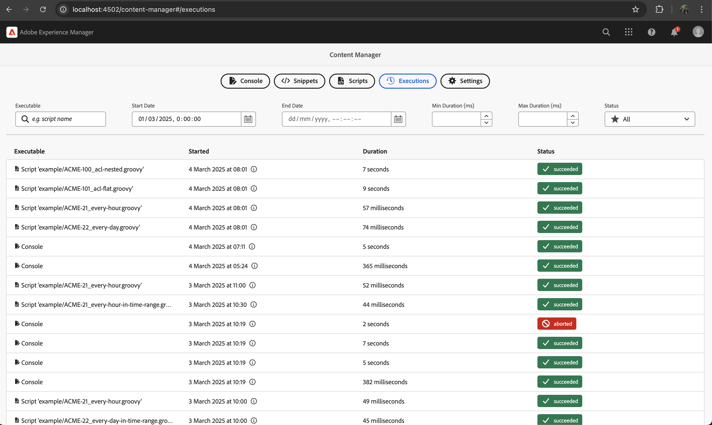
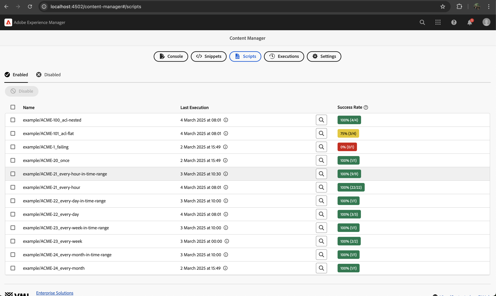
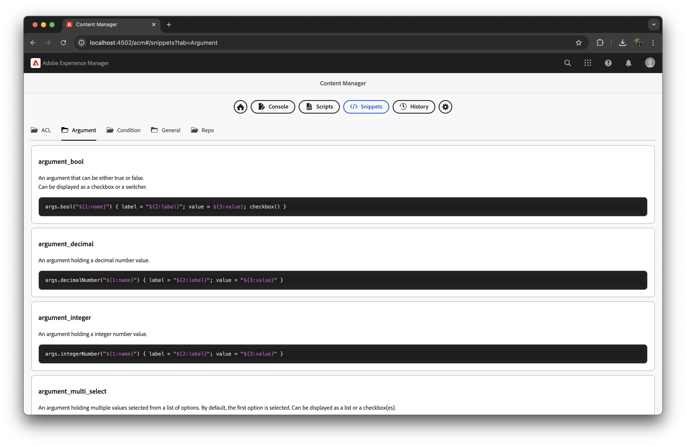

<a href="https://www.vml.com/expertise/enterprise-solutions">
  <picture>
    <source srcset="docs/vml-logo-white.svg" media="(prefers-color-scheme: dark)">
    
  </picture>
</a>

[](https://github.com/wttech/acm/releases)
[](https://github.com/wttech/acm/releases)
[](https://github.com/wttech/acm/actions/workflows/check.yml)

[](http://www.apache.org/licenses/)

**AEM Content Manager (ACM)**

Tool for doing live content and permission updates for AEM applications in a simple and flexible way.

Simply [install](#installation) ready-to-use CRX package on AEM instance and start migrating!

<p>
  
</p>

<p>
  
</p>

<p>
  
</p>

<p>
  
</p>

<p>
  
</p>

---

Main concepts of AEM Content Manager tool are:

* **Simplicity**
    * Creating migration scripts should be as much simple as it is possible (no need to learn custom YML syntax or configuration language, just well-known Groovy),
    * No extra configuration needed - no hooks to needed to be configured in an AEM build (just provide Groovy scripts, the tool will do the rest),
* **Stability**
    * Executed always at optimal moment - safely use any classes from any OSGi bundles including your own,

## Installation

The ready-to-install AEM packages are available on [GitHub releases](https://github.com/wttech/acm/releases).

There are two ways to install AEM Content Manager on your AEM instances:

1. Using the 'all' package:
    * Recommended for fresh AEM instances.
    * This package will also install AEM Groovy Console and AEM Content Manager examples.
2. Using the 'minimal' package:
    * Recommended for AEM instances that already contain some dependencies shared with other tools.
    * This package does not include Groovy bundles, which can be provided by other tools like [AEM Easy Content Upgrade](https://github.com/valtech/aem-easy-content-upgrade/releases) (AECU) or [AEM Groovy Console](https://github.com/orbinson/aem-groovy-console/releases).
    * Note that these other tools are not required for AEM Content Manager to work. Moreover, they all could be replaced by AEM Content Manager.

## Compatibility

| AEM Content Manager | AEM        | Java  | Groovy |
|---------------------|------------|-------|--------|
| 1.0.0               | 6.5, cloud | 8, 11 | 4.x    |

Note that AEM Content Manager is using Groovy scripts concept. However, it is **not** using [AEM Groovy Console](https://github.com/icfnext/aem-groovy-console). It is done intentionally, because Groovy Console has close dependencies to concrete AEM version.
AEM Content Manager tool is implemented in a AEM version agnostic way, to make it more universal and more fault-tolerant when AEM version is changing.
It is compatible with AEM Groovy Console - simply install one of AEM Content Manager distributions without Groovy console OSGi bundle included as it is usually provided by Groovy Console AEM package.

## Documentation

### Basics

Groovy code can be run in three ways:

1. Ad-hoc using 'Console'
2. Manually executed scripts - see 'Scripts' page then 'Manual' tab)
3. Automatically executed scripts - see 'Scripts' page then 'Automatic' tab)

Code executed in the console is executed in the context of the currently logged user to AEM. 

Code executed in the 'Scripts' page is executed in the context of the system user or impersonated user when configured additionally.

Code can leverage any Java code deployed in AEM instance as OSGi bundles including project code.
To allow that, ACM performs health checks:

- OSGi bundles (with ability to exclude some of them to address known issues)
- OSGi events occurrence indicating temporal instability
- JCR repository paths presence (e.g. /content/acme, /content/dam/acme)

### Extension scripts

To add own code binding or hook into execution process, you can create your own extension Groovy scripts and place them at path like `/conf/acm/settings/extension/acme/main.groovy`.

For example:

```groovy
void extend(Extender extender) {
  extender.codeBindingVariable("acme", AcmeApi.class) { new AcmApiImpl(executionContext.resourceResolver)) }
  // or just  
  extender.codeBindingVariable("acme") { new AcmApiImpl(executionContext.resourceResolver) }
}

void completeExecution(Execution execution) {
   if (execution.status === 'FAILED') {
      // send Slack/MS Teams message or something
   }
}
```

### OSGi Configuration

- Code Executor
  - Source Code: [(here)](src/main/java/com/wttech/aem/acm/core/code/Executor.java) 
  - Web Console: [com.wttech.aem.acm.core.code.Executor](http://localhost:4502/system/console/configMgr/com.wttech.aem.acm.core.code.Executor)
- Script Scheduler
  - Source Code: [(here)](src/main/java/com/wttech/aem/acm/core/script/ScriptScheduler.java) 
  - Web Console: [com.wttech.aem.acm.core.script.ScriptScheduler](http://localhost:4502/system/console/configMgr/com.wttech.aem.acm.core.script.ScriptScheduler)
- Code Execution Queue (Sling Job):
  - Web Console: [org.apache.sling.event.jobs.QueueConfiguration~acmexecutionqueue](http://localhost:4502/system/console/configMgr/org.apache.sling.event.jobs.QueueConfiguration~acmexecutionqueue)

## Other tools

TODO

## Authors

- Founder, owner, and maintainer: [Krystian Panek](mailto:krystian.panek@vml.com)
- Developers: [Mariusz Pacyga](mailto:mariusz.pacyga@vml.com), [Dominik Przybył](mailto:dominik.przybyl@vml.com), [Kamil Orwat](mailto:kamil.orwat@vml.com)
- Consultancy: [Tomasz Sobczyk](mailto:tomasz.sobczyk@vml.com), [Jakub Przybytek](mailto:jakub.przybytek@vml.com)
- Contributors: [&lt;see all&gt;](https://github.com/wttech/aemc/graphs/contributors)

## Contributing

Issues reported or pull requests created will be very appreciated.

1. Fork plugin source code using a dedicated GitHub button.
2. Do code changes on a feature branch created from *main* branch.
3. Create a pull request with a base of *main* branch.

## Development


1. All-in-one command (incremental building and deployment of 'all' distribution, both backend & frontend)

    ```shell
    sh taskw develop:all
    ```

2. Example contents

    ```shell
    sh taskw develop:content:example
    ```

3. Frontend with live reloading:

    ```shell
    sh taskw develop:frontend:dev
    ```

## License

**AEM Content Manager** is licensed under the [Apache License, Version 2.0 (the "License")](https://www.apache.org/licenses/LICENSE-2.0.txt)
