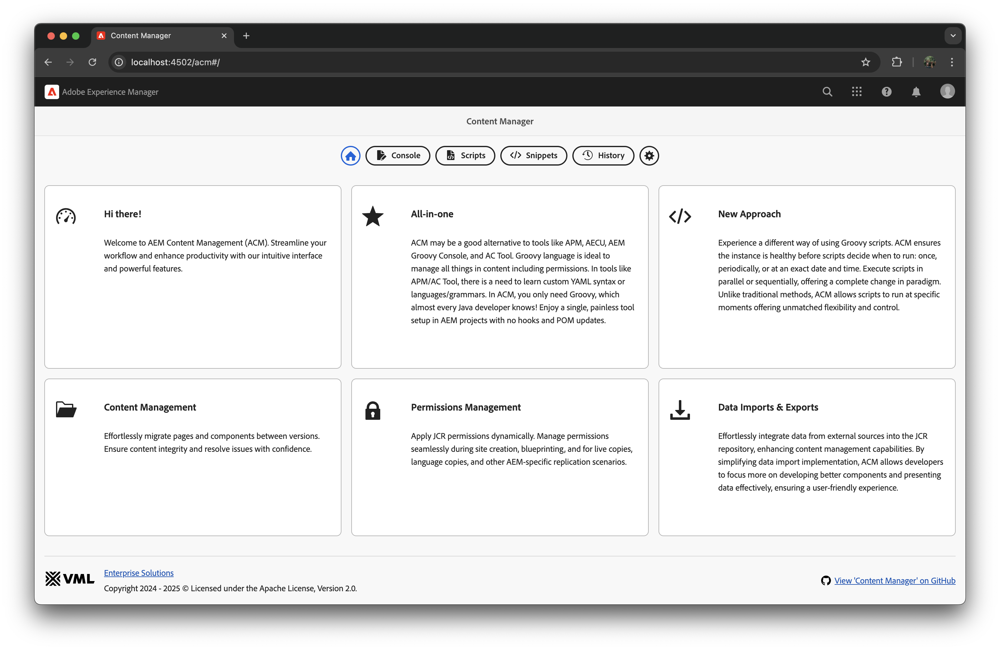
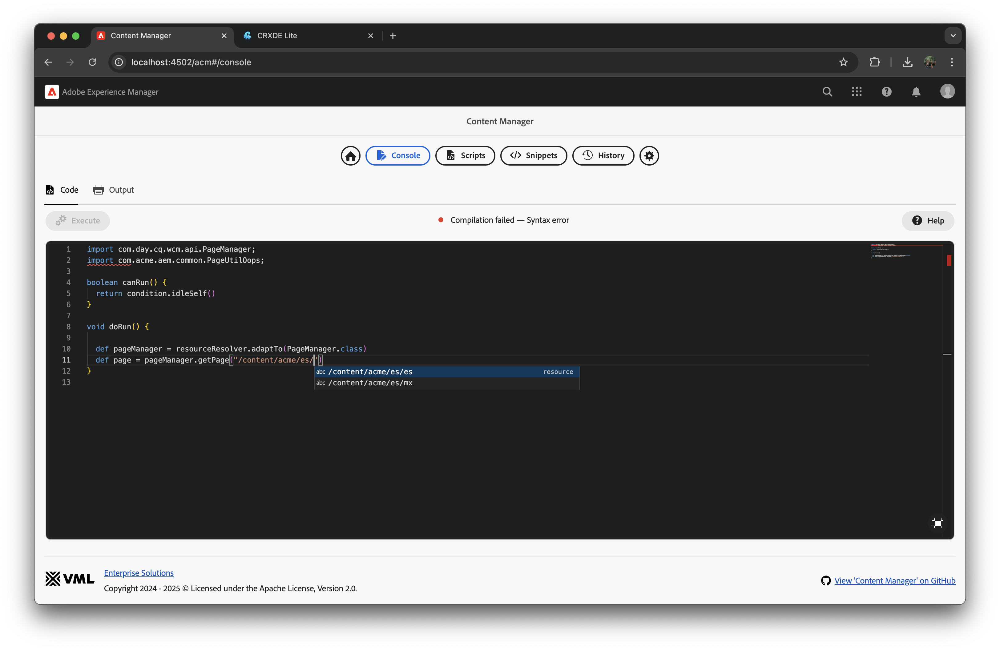
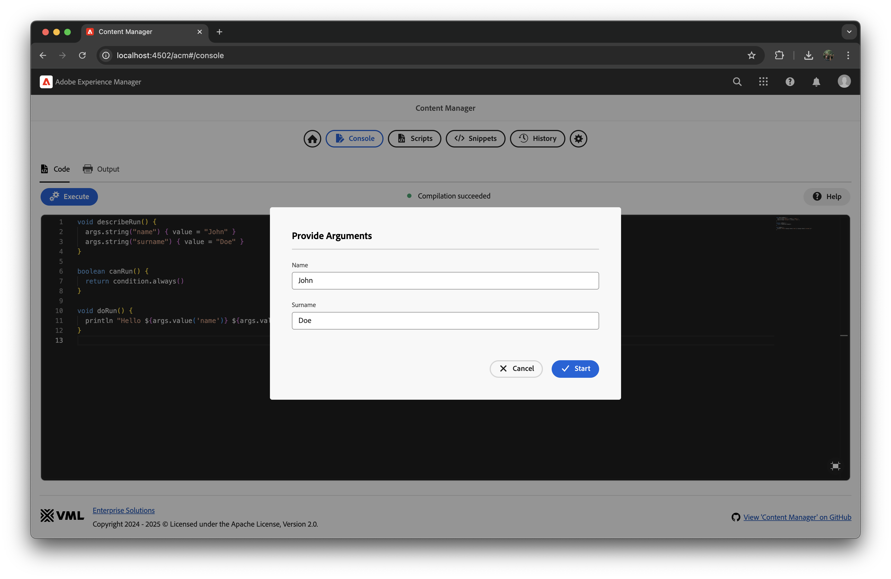
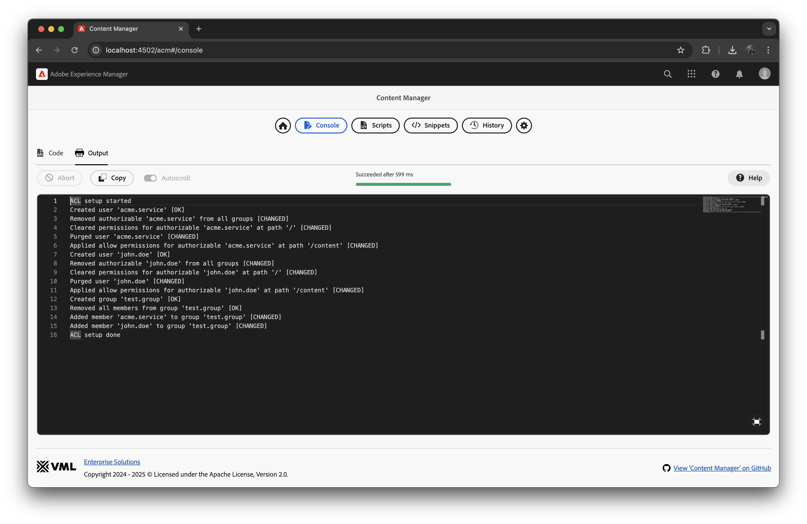
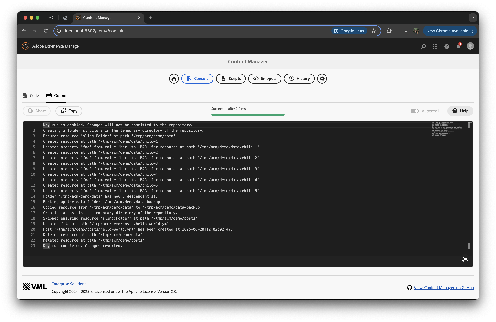
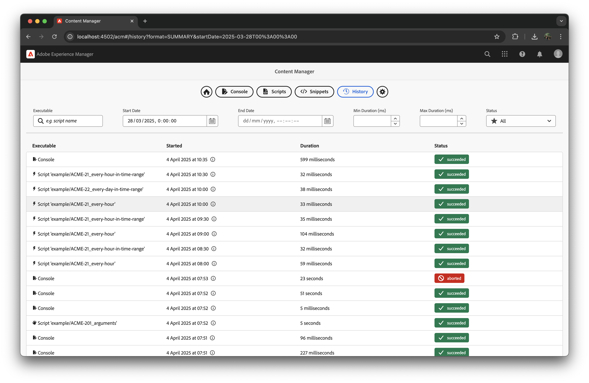
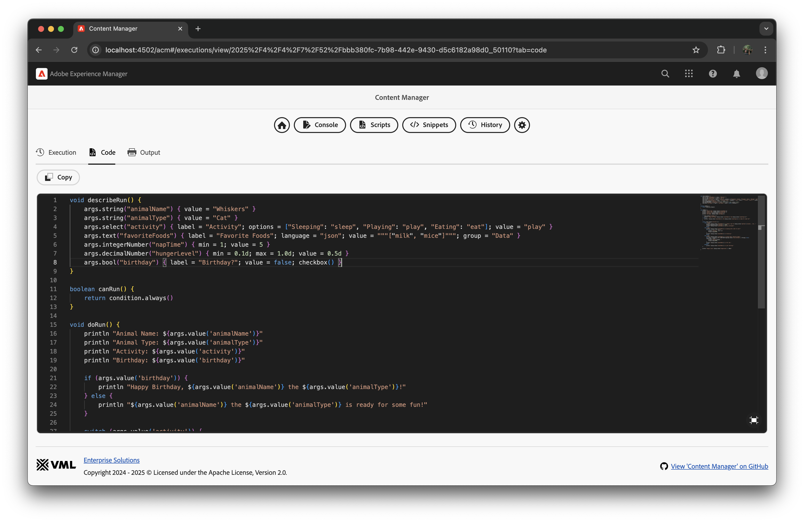
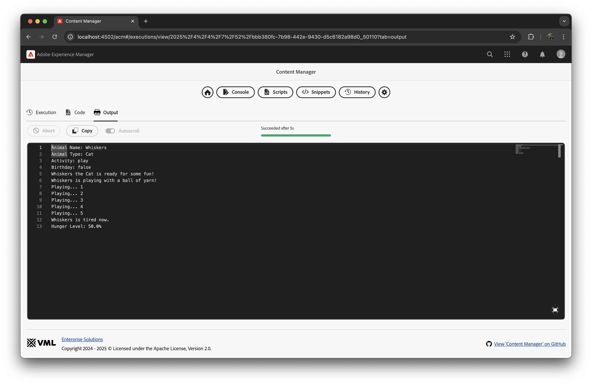
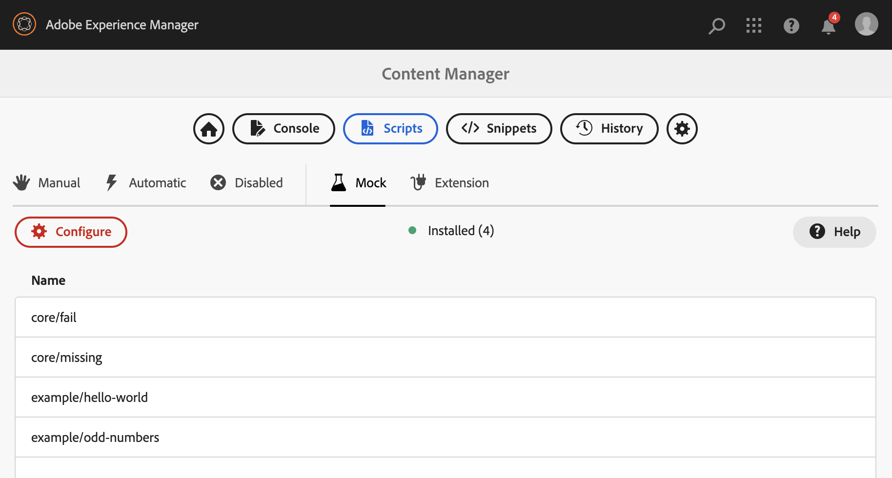
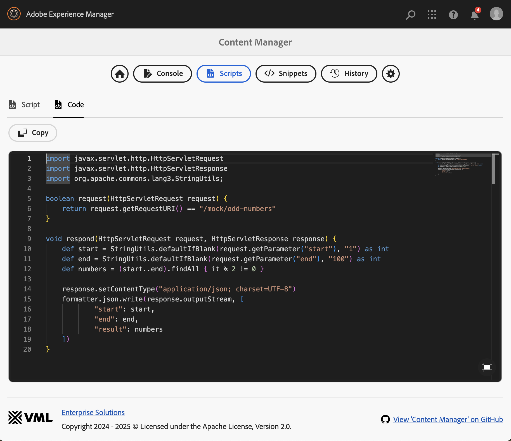

<a href="https://www.vml.com/expertise/enterprise-solutions" target="_blank">
  <picture>
    <source srcset="docs/vml-logo-white.svg" media="(prefers-color-scheme: dark)">
    
  </picture>
</a>

[](https://github.com/wttech/acm/releases)
[](https://github.com/wttech/acm/releases)
[](https://github.com/wttech/acm/actions/workflows/check.yml)
[](http://www.apache.org/licenses/)

# AEM Content Manager (ACM)

<p>
<picture>
    <source srcset="docs/acm-logo-white.svg" media="(prefers-color-scheme: dark)">
    
</picture>
</p>

**Manage permissions & content updates as-a-code.**

ACM streamlines workflows and boosts productivity with an intuitive interface and robust features. It automates bulk content and permission changes, making it ideal for content migration and large-scale permission management. ACM offers an IDE-like experience with code completion, auto-import, and on-the-fly compilation.

It works seamlessly across AEM on-premise, AMS, and AEMaaCS environments.



## Table of Contents

- [Key Features](#key-features)
    - [All-in-one Solution](#all-in-one-solution)
    - [New Approach](#new-approach)
    - [Content Management](#content-management)
    - [Permissions Management](#permissions-management)
    - [Data Imports & Exports](#data-imports--exports)
- [Installation](#installation)
- [Compatibility](#compatibility)
- [Documentation](#documentation)
    - [Usage](#usage)
    - [Console](#console)
    - [Content Scripts](#content-scripts)
        - [Minimal Example](#minimal-example)
        - [Arguments Example](#arguments-example)
        - [ACL Example](#acl-example)
        - [Repo Example](#repo-example)
        - [History](#history)
    - [Extension Scripts](#extension-scripts)
    - [Snippets](#snippets)
    - [Mocks](#mocks)
- [Development](#development)
- [Authors](#authors)
- [Contributing](#contributing)
- [License](#license)

## Key Features

### All-in-one Solution

ACM is a comprehensive alternative to tools like APM, AECU, AEM Groovy Console, and AC Tool.
It leverages the Groovy language, which is familiar to most Java developers, eliminating the need to learn custom YAML syntax or languages/grammars. 
Enjoy a single, painless tool setup in AEM projects with no hooks and POM updates.

### New Approach

Experience a different way of using Groovy scripts. 
ACM ensures the instance is healthy before scripts decide when to run: once, periodically, or at an exact date and time. 
Execute scripts in parallel or sequentially, offering unmatched flexibility and control.

### Content Management

Effortlessly migrate pages and components between versions. Ensure content integrity and resolve issues with confidence.

### Permissions Management

Apply JCR permissions dynamically. 
Manage permissions seamlessly during site creation, blueprinting, and for live copies, language copies, and other AEM-specific replication scenarios.

### Data Imports & Exports

Effortlessly integrate data from external sources into the JCR repository, enhancing content management capabilities. 
By simplifying data import implementation, ACM allows developers to focus more on developing better components and presenting data effectively, ensuring a user-friendly experience.

## Installation

The ready-to-install AEM packages are available on:

- [GitHub releases](https://github.com/wttech/acm/releases).
- [Maven Central](https://central.sonatype.com/search?q=dev.vml.es.acm).

There are two ways to install AEM Content Manager on your AEM instances:

1. **Using the 'all' package:**
    * Recommended for fresh AEM instances.
    * This package will also install Groovy Bundles ([groovy](https://mvnrepository.com/artifact/org.apache.groovy/groovy) and [groovy-templates](https://mvnrepository.com/artifact/org.apache.groovy/groovy-templates)).
2. **Using the 'minimal' package:**
    * Recommended for AEM instances that already contain some dependencies shared with other tools.
    * This package does not include Groovy bundles, which can be provided by other tools like [AEM Easy Content Upgrade](https://github.com/valtech/aem-easy-content-upgrade/releases) (AECU) or [AEM Groovy Console](https://github.com/orbinson/aem-groovy-console/releases).

For AEM On-Premise and AEM Managed Service (AMS) deployments, just install the ACM package using the AEM Package Manager.

For AEMaaCS deployments, embed the ACM package as a part of project-specific 'all' package like other vendor packages in the [AEM Project Archetype](https://github.com/adobe/aem-project-archetype/blob/develop/src/main/archetype/all/pom.xml):

Adjust file 'all/pom.xml':

1. Add dependency to [all](https://central.sonatype.com/artifact/dev.vml.es/acm.all) or [min](https://central.sonatype.com/artifact/dev.vml.es/acm.min) package in the *dependencies* section:

    ```xml
    <dependency>
        <groupId>dev.vml.es</groupId>
        <artifactId>acm.all</artifactId>
        <version>${acm.version}</version>
        <type>zip</type>
    </dependency>
    ```

2. Add embedding in *filevault-package-maven-plugin* configuration:

    ```xml
    <embedded>
        <groupId>dev.vml.es</groupId>
        <artifactId>acm.all</artifactId>
        <type>zip</type>
        <target>/apps/${appId}-vendor-packages/application/install</target>
    </embedded>
    ```

    Remember to replace `${acm.version}` and `${appId}` with the actual values.

    Repeat the same for [ui.content.example](https://central.sonatype.com/artifact/dev.vml.es/acm.ui.content.example) package if you want to install demonstrative ACM scripts to get you started quickly.

3. Consider refining the ACL settings

   The default settings are defined in the [repo init OSGi config](https://github.com/wttech/acm/blob/main/ui.config/src/main/content/jcr_root/apps/acm-config/osgiconfig/config/org.apache.sling.jcr.repoinit.RepositoryInitializer~acm.config), which effectively restrict access to the tool and script execution to administrators only—a recommended practice for production environments.
   If you require further customization, you can create your own repo init OSGi config to override or extend the default configuration.

## Compatibility

| AEM Content Manager | AEM        | Java | Groovy |
|---------------------|------------|------|--------|
| 1.x                 | 6.x, cloud | 8+   | 4.x    |

Note that AEM Content Manager is using Groovy scripts concept. However, it is **not** using [AEM Groovy Console](https://github.com/icfnext/aem-groovy-console). It is done intentionally, because Groovy Console has close dependencies to concrete AEM version.
AEM Content Manager tool is implemented in a AEM version agnostic way, to make it more universal and more fault-tolerant when AEM version is changing.

## Documentation

### Usage

The ACM tool helps developers to implement Groovy scripts in AEM projects.
Groovy code need to at first implemented and tested then persisted in the AEM instance for later deployment.
To achieve that, ACM provides a set of features to help you with the development process.

**Groovy code can be run in three ways:**

1. **Ad-hoc using 'Console'**
   - Code executed in the console is run in the context of the currently logged user to AEM.

2. **Manually executed scripts**
   - Navigate to the 'Scripts' page and select the 'Manual' tab.
   - Code executed here also runs in the context of the current user.

3. **Automatically executed scripts**
   - Navigate to the 'Scripts' page and select the 'Automatic' tab.
   - Code can be scheduled to run once, periodically, or at an exact date and time. Runs in the context of the system user or impersonated user set in the configuration.

**Rules for executing Groovy code:**

- **Context**: Code can leverage any Java code deployed in the AEM instance as OSGi bundles, including project code.
- **Health Checks**: ACM performs health checks to ensure the instance is stable before executing scripts. These checks include:
  - OSGi bundles (with the ability to exclude some to address known issues)
  - OSGi events occurrence indicating temporal instability
  - JCR repository paths presence (e.g., `/content/acme`, `/content/dam/acme`)

### Console

The ACM Console is interactive and offers the following features:

- Execute just-in-time Groovy code.
- Review the output of the code in real-time.
- View compilation errors as you type.
- Access a list of available variables and methods.
- Utilize code completion assistance for OSGi classes, JCR paths, etc.
- Quickly insert code templates using snippets.



### Content scripts

Content scripts in ACM are Groovy scripts that can be used to automate various tasks in AEM. 
These scripts can be placed in specific locations within the AEM repository to control their execution behavior.

- `/conf/acm/settings/script/auto/enabled/{project}`: Automatically executed scripts that are enabled and awaiting execution if `canRun` conditions are met.
- `/conf/acm/settings/script/auto/disabled/{project}`: Automatically executed scripts that are disabled, serving as a safety guard to quickly disable scripts under unexpected circumstances.
- `/conf/acm/settings/script/manual/{project}`: Manually executed scripts, run under specific circumstances by platform administrators.

#### Minimal example

Below is a minimal example of a Groovy script that prints "Hello World!" to the console.

```groovy
boolean canRun() {
    return condition.always()
}

void doRun() {
    println "Hello World!"
}
```

The `canRun()` method is used to determine if the script should be executed.
The `doRun()` method contains the actual code to be executed.

Notice that the script on their own decide when to run without a need to specify any additional metadata. In that way the-sky-is-the-limit. You can run the script once, periodically, or at an exact date and time.
There are many built-in, ready-to-use conditions available in the `condition` [service](https://github.com/wttech/acm/blob/main/core/src/main/java/dev/vml/es/acm/core/code/Condition.java).

#### Arguments example

Scripts could accept arguments, which are passed to the script when it is executed.

```groovy
void describeRun() {
    arguments.string("name") { value = "John" }
    arguments.string("surname") { value = "Doe" }
}

boolean canRun() {
    return condition.always()
}

void doRun() {
    println "Hello ${arguments.value('name')} ${arguments.value('surname')}!"
}
```

The `describeRun()` method is used to define the arguments that can be passed to the script.
The `args` service is used to define the arguments that can be passed to the script.
When the script is executed, the arguments are passed to the `doRun()` method.

There are many built-in argument types to use handling different types of data like string, boolean, number, date, file, etc. Just check `arguments` [service](https://github.com/wttech/acm/blob/main/core/src/main/java/dev/vml/es/acm/core/code/Arguments.java) for more details.



Be inspired by reviewing examples like [page thumbnail script](https://github.com/wttech/acm/blob/main/ui.content.example/src/main/content/jcr_root/conf/acm/settings/script/manual/example/ACME-202_page-thumbnail.groovy) which allows user to upload a thumbnail image and set it as a page thumbnail with only a few clicks and a few lines of code.

#### ACL example

The following example demonstrates how to create a user and a group, assign permissions, and add members to the group using the [ACL service](https://github.com/wttech/acm/blob/main/core/src/main/java/dev/vml/es/acm/core/acl/Acl.java) (`acl`).

```groovy
boolean canRun() {
    return condition.idleSelf() && condition.everyHour()
}

void doRun() {
    out.fromAclLogs()

    println "ACL setup started"

    def acmeService = acl.createUser { id = "acme.service"; systemUser(); skipIfExists() }
    acmeService.with {
        // purge()
        allow { path = "/content"; permissions = ["jcr:read", "jcr:write"] }
    }

    def johnDoe = acl.createUser { id = "john.doe"; fullName = "John Doe"; password = "ilovekittens"; skipIfExists() }
    johnDoe?.with {
        // purge()
        allow("/content", ["jcr:read"])
    }

    acl.createGroup { id = "test.group" }.with {
        // removeAllMembers()
        addMember(acmeService)
        addMember(johnDoe)
    }

    println "ACL setup done"
}
```

Operations done by `acl` service are idempotent, so you can run the script multiple times without worrying about duplicates, failures, or other issues.
Logging is very descriptive, allowing you to see what was done and what was skipped.

ACL scripts can be scheduled to run at regular intervals, automatically adapting permissions to the evolving, project-specific structure of your AEM content.



#### Repo example

You can leverage the [repository service](https://github.com/wttech/acm/blob/main/core/src/main/java/dev/vml/es/acm/core/repo/Repo.java) (`repo`) to efficiently perform JCR operations such as reading, writing, and deleting nodes with concise, expressive code.
The out-of-the-box AEM API often requires extensive boilerplate code and can behave unpredictably in certain scenarios. The [RepoResource](https://github.com/wttech/acm/blob/main/core/src/main/java/dev/vml/es/acm/core/repo/RepoResource.java) API streamlines these operations, making repository programming more enjoyable, concise, and reliable.

The repo service abstracts away the complexity of managing dry-run and auto-commit behaviors—features that are often error-prone and cumbersome to implement manually — ensuring safe, predictable, and streamlined repository operations.

```groovy
void describeRun() {
    arguments.bool("dryRun") { value = true; switcher(); description = "Do not commit changes to the repository" }
    arguments.bool("clean") { value = true; switcher(); description = "Finally delete all created resources" }
}

boolean canRun() {
    return condition.idleSelf()
}

void doRun() {
    out.fromLogs()

    repo.dryRun(arguments.value("dryRun")) {
        println "Creating a folder structure in the temporary directory of the repository."
        def dataFolder = repo.get("/tmp/acm/demo/data").ensureFolder()
        for (int i = 0; i < 5; i++) {
            def child = dataFolder.child("child-\${i+1}").save(["foo": "bar"])
            child.updateProperty("foo") { v -> v.toUpperCase() }
        }
        println "Folder '${dataFolder.path}' has now ${dataFolder.descendants().count()} descendant(s)."

        println "Creating a post in the temporary directory of the repository."
        def postFolder = repo.get("/tmp/acm/demo/posts").ensureFolder()
        def post = postFolder.child("hello-world.yml").saveFile("application/x-yaml") { output ->
            formatter.yml.write(output, [
                    title: "Hello World",
                    description: "This is a sample post.",
                    tags: ["sample", "post"]
            ])
        }
        println "Post '${post.path}' has been created at ${post.property("jcr:created", java.time.LocalDateTime)}"

        if (arguments.value("clean")) {
            dataFolder.delete()
            postFolder.delete()
        }
    }
}
```



### History

All code executions are logged in the history. You can see the status of each execution, including whether it was successful or failed. The history also provides detailed logs for each execution, including any errors that occurred.
Original code is stored in the history, so you can always refer back to it if needed.
Complete output as well as argument values are also included to achieve full traceability.





### Extension scripts

To add own code binding or hook into execution process, you can create your own extension Groovy scripts and place them at path like `/conf/acm/settings/extension/acme/main.groovy`.

#### Example extension script

```groovy
import dev.vml.es.acm.core.code.ExecutionContext
import dev.vml.es.acm.core.code.Execution

void prepareRun(ExecutionContext executionContext) {
    executionContext.variable("acme", new AcmeFacade())
}

void completeRun(Execution execution) {
    if (execution.status.name() == 'FAILED') {
        log.error "Something nasty happened with '${execution.executable.id}'!"
        // TODO send notification on Slack, MS Teams, etc using HTTP client / WebAPI
    }
}

class AcmeFacade {
    def now() {
        return new Date()
    }
}
```

### Snippets

ACM provides a set of snippets that can be used to quickly insert code templates into your scripts. 
Despite out-of-the-box snippets, you can create your own snippets and share them with your team.

Just create a YAML files in the `/conf/acm/settings/snippet/available/{project}` folder and add your code there.

#### Example snippet

Note that snippets could contain placeholders, which are replaced with actual values when the snippet is inserted into the script.
Also, snippet documentation could use [GitHub Flavored Markdown](https://github.github.com/gfm/) syntax, which is later rendered in the UI. As a consequence, you can use HTML tags as well, provide links, images, etc.

Let's assume a snippet located at path `/conf/acm/settings/snippet/available/acme/hello.yml` with the following content:

```yaml
group: Acme
name: acme_hello
content: |
  println "Hello ${1:message} in ACME project!" }
documentation: |
  Prints a greeting message in the ACME project.
```


### Mocks

ACM has incorporated the [AEM Stubs tool](https://github.com/wttech/aem-stubs), which allows you to create mock HTTP responses for testing purposes also via Groovy Scripts.
This feature is disabled by default, but you can enable it in the [OSGi configuration](http://localhost:4502/system/console/configMgr/com.vml.es.aem.acm.core.mock.MockHttpFilter).




## Development

1. All-in-one command (incremental building and deployment of 'all' distribution, both backend & frontend)

    ```shell
    sh taskw develop:all
    ```

2. Example contents

    ```shell
    sh taskw develop:content:example
    ```

3. Frontend with live reloading:

    ```shell
    sh taskw develop:frontend:dev
    ```

## Releasing

1. To check the last release version, run:

    ```shell
    sh taskw release
    ```
 
2. To release a new version, run:

    ```shell
    sh taskw release -- <new-version>
    ```

## Authors

- Founder, owner, and maintainer: [Krystian Panek](mailto:krystian.panek@vml.com)
- Consultancy, tests: [Tomasz Sobczyk](mailto:tomasz.sobczyk@vml.com), [Jakub Przybytek](mailto:jakub.przybytek@vml.com)
- Developers: [Mariusz Pacyga](mailto:mariusz.pacyga@vml.com), [Dominik Przybył](mailto:dominik.przybyl@vml.com), [Kamil Orwat](mailto:kamil.orwat@vml.com)
- Contributors: [&lt;see all&gt;](https://github.com/wttech/aemc/graphs/contributors)

## Contributing

Issues reported or pull requests created will be very appreciated.

1. Fork plugin source code using a dedicated GitHub button.
2. Do code changes on a feature branch created from *main* branch.
3. Create a pull request with a base of *main* branch.

## License

**AEM Content Manager** is licensed under the [Apache License, Version 2.0 (the "License")](https://www.apache.org/licenses/LICENSE-2.0.txt)
