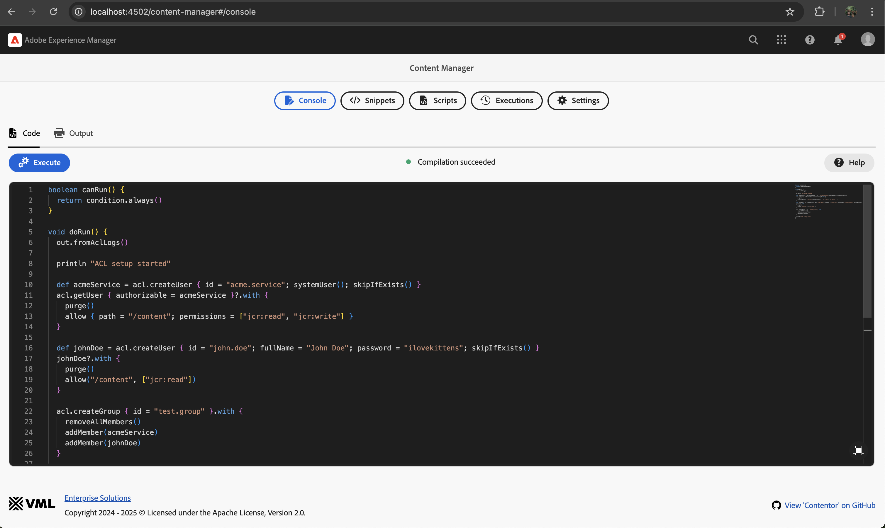

<!--

-->

<!--

  

-->

Tool for migrating content and managing permissions for AEM applications in a simple and flexible way.

Simply [install](#installation) ready-to-use CRX package on AEM instance and start migrating!

  

  

Main concepts of AEM Migrator tool are:

* **Simplicity**
    * Creating migration scripts should be as much simple as it is possible,
    * No extra configuration needed - no hooks to needed to be configured in a AEM build,
* **Stability**
    * Executed always at optimal moment - safely use any classes from any OSGi bundles including your own,

## Installation

The ready-to-install AEM packages are available on [GitHub releases](https://github.com/wttech/aem-migrator/releases).

There are two ways to install AEM Migrator on your AEM instances:

1. Using the 'all' package:
    * Recommended for fresh AEM instances.
    * This package will also install AEM Groovy Console and AEM Migrator examples.
2. Using the 'minimal' package:
    * Recommended for AEM instances that already contain some dependencies shared with other tools.
    * This package does not include Groovy bundles, which can be provided by other tools like [AEM Easy Content Upgrade](https://github.com/valtech/aem-easy-content-upgrade/releases) (AECU) or [AEM Groovy Console](https://github.com/orbinson/aem-groovy-console/releases).

## Compatibility

| AEM Migrator | AEM        | Java | Groovy |
|--------------|------------|------|--------|
| 1.0.0        | 6.5, cloud | 11   | 4.x    |

Note that AEM Migrator is using Groovy scripts concept. However it is **not** using [AEM Groovy Console](https://github.com/icfnext/aem-groovy-console). It is done intentionally, because Groovy Console has close dependencies to concrete AEM version.
AEM Migrator tool is implemented in a AEM version agnostic way, to make it more universal and more fault-tolerant when AEM version is changing.
It is compatible with AEM Groovy Console - simply install one of AEM Migrator distributions without Groovy console OSGi bundle included as it is usually provided by Groovy Console AEM package.

## Documentation

### Basics

TODO

### OSGi configuration

TODO

## Other tools

TODO

## Authors

* [Krystian Panek](mailto:krystian.panek@vml.com) - Project Founder, Main Developer,
* [Dominik Przybył](mailto:dominik.przybyl@vml.com) - Main Developer.

## Contributing

Issues reported or pull requests created will be very appreciated.

1. Fork plugin source code using a dedicated GitHub button.
2. Do code changes on a feature branch created from *main* branch.
3. Create a pull request with a base of *main* branch.

## Building

To build all the modules run in the project root directory the following command with Maven 3:

    mvn clean install

To build all the modules and deploy the `all` package to a local instance of AEM, run in the project root directory the following command:

    mvn clean install -PautoInstallSinglePackage

Or to deploy it to a publish instance, run

    mvn clean install -PautoInstallSinglePackagePublish

Or alternatively

    mvn clean install -PautoInstallSinglePackage -Daem.port=4503

Or to deploy only the bundle to the author, run

    mvn clean install -PautoInstallBundle

Or to deploy only a single content package, run in the sub-module directory (i.e `ui.apps`)

    mvn clean install -PautoInstallPackage

## License

**AEM Migrator** is licensed under the [Apache License, Version 2.0 (the "License")](https://www.apache.org/licenses/LICENSE-2.0.txt)
