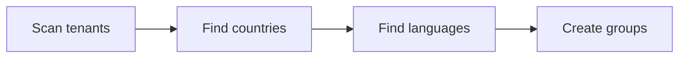

# ACM scripts

How ACM runs scripts and how to use its services. Exact signatures are in the [API reference](api.md).

## Execution

- Scripts run in the AEM JVM and can use any Java class deployed as an OSGi bundle, including project code. Import classes as in Java.
- Console and manual scripts run as the current user; automatic scripts as the configured service user or an impersonated user.
- Before running automatic scripts, ACM waits until the instance is healthy (OSGi bundles active, no recent bundle events, required repository paths present).
- Every run is recorded in the history with its code, inputs, console output and outputs, unless run without history.
- The `repo` service commits changes automatically. Inside `repo.dryRun(true) { … }` changes are reverted instead.

## Lifecycle methods

| Method | Purpose |
|---|---|
| `void describeRun()` | Declare inputs and per-script settings such as `context.lockTimeout`. Runs before the inputs form is shown, so keep it free of side effects. |
| `boolean canRun()` | Return `true` to run. Required. |
| `void doRun()` | The work. Required. |
| `def scheduleRun()` | Automatic scripts only: `schedules.cron('…')`, `schedules.boot()` (default, on instance start) or `schedules.none()`. |

## Conditions

Used in `canRun()`, combinable with `&&` and `||`.

| Condition | Runs when |
|---|---|
| `conditions.always()` | Every time. Default for console and manual scripts. |
| `conditions.never()` | Never. Disables a script temporarily. |
| `conditions.once()` | Never run before. No retry after a failure. |
| `conditions.changed()` | Script content changed, or the instance changed after a failed run. Best default for automatic scripts deployed with the code. |
| `conditions.contentChanged()` | Script content changed, or never run before. |
| `conditions.instanceChanged()` | Instance state changed (OSGi bundles or ACM restarted). |
| `conditions.retryIfInstanceChanged()` | Previous run failed and the instance changed since. |
| `conditions.notSucceeded()` | Previous run did not succeed. Retries until it does. |
| `conditions.retry(count)` | Not succeeded yet, and failed fewer than `count` times in a row. |
| `conditions.passed(duration)` | At least `duration` (or seconds) passed since the previous run. |
| `conditions.executedInRange(start, end)` | Ran in the given date-time range. |
| `conditions.locked(name)`, `conditions.unlocked(name)` | A named repository lock is (not) held. |
| `conditions.isInstanceAuthor()`, `isInstancePublish()` | Instance role. |
| `conditions.isInstanceRunMode('dev')` | Instance has the run mode. |
| `conditions.isInstanceOnPrem()`, `isInstanceCloud()`, `isInstanceCloudSdk()`, `isInstanceCloudContainer()` | Instance type. |

## Schedules

Automatic scripts run on instance boot by default. To run periodically, return a Quartz cron expression (with seconds) and use `conditions.always()`, or a time-based condition, in `canRun()`:

```groovy
def scheduleRun() {
    return schedules.cron('0 0 2 ? * * *') // daily at 2:00
}
```

## Inputs

Declared in `describeRun()` as `inputs.<type>('name') { options }`, read in `doRun()` with `inputs.value('name')`. All inputs share these options: `value` (default), `label`, `description`, `group` (tab name), `required()`/`optional()`, `validator` (JavaScript expression).

| Input | Value | Notable options |
|---|---|---|
| `bool` | `Boolean` | `switcher()`, `checkbox()` |
| `string` | `String` | `password()`, `email()`, `url()`, `tel()`, `numeric()`, `decimal()` |
| `text` | `String` (multi-line) | `language = 'json'` for a code editor |
| `path` | `String` (JCR path) | `rootPathInclusive = '/content/acme'` |
| `select`, `multiSelect` | option value(s) | `options = ['a', 'b']` or a label-to-value map; `dropdown()`, `radio()` / `list()`, `checkbox()` |
| `integerNumber`, `decimalNumber` | `Integer`, `BigDecimal` | `min`, `max`, `step`, `slider()` |
| `integerRange`, `decimalRange` | `[from, to]` list | `min`, `max`, `step` |
| `date`, `time`, `dateTime` | `LocalDate`, `LocalTime`, `LocalDateTime` | `min`, `max` |
| `color` | `String` | |
| `file`, `multiFile` | uploaded file(s) | `mimeTypes`, `images()`, `pdfs()`, `zips()` |
| `map`, `keyValueList` | `Map`, list of entries | |

```groovy
void describeRun() {
    inputs.select('language') { options = ['en', 'de', 'fr']; value = 'en' }
    inputs.integerNumber('limit') { value = 100; min = 1; max = 1000 }
    inputs.file('csv') { description = 'CSV with one page path per line' }
}
```

## Outputs

```groovy
def report = outputs.file('report') {
    label = 'Report'
    description = 'Pages without a title'
    downloadName = 'report.csv'
}
report.out.println('path,template')

outputs.text('summary') {
    label = 'Summary'
    value = "Processed ${count} pages"
}
outputs.text('config') { value = json; language = 'json' }
```

File outputs are kept with the execution in the history and can be downloaded later. Text outputs support Markdown and syntax highlighting.

## Console and logging

| Call | Goes to | Use for |
|---|---|---|
| `log.info/warn/error/debug/trace` | console and AEM logs | start, summary, errors, anything worth keeping |
| `out.info/success/warn/error/debug` | console only, timestamped | progress and status |
| `println`, `printf` | console only | quick debugging, plain text results |

Log the start with key parameters, progress every few hundred items in long loops, and a summary with counts. Pass the exception to `log.error("…", e)`.

## Aborting

Users can abort running scripts. Call `context.checkAborted()` at the top of every loop iteration. To clean up first, check `context.isAborted()`, clean up, then call `context.checkAborted()`.

## Locking

A script holds a lock while it runs, so it never runs twice at the same time; a concurrent attempt ends as `LOCKED`. The lock expires after the global timeout (24 hours by default). For long or critical scripts, set it in `describeRun()`:

```groovy
void describeRun() {
    context.lockTimeout = '2h' // also 'PT2H', Duration, milliseconds; 0 or less disables expiration
}
```

## Documentation

ACM shows a script's documentation in the UI. Write it as a regular block comment `/* */` (not JavaDoc `/** */`) at the top of the file, or right after the imports, and follow it with a blank line:

````groovy
/*
---
version: '1.0'
author: jane.doe@acme.com
schedule: Every hour at 10 minutes past the hour
category: security
tags: ['acl', 'authors']
---
Creates content author groups for each tenant, country and language.

Groups are named `{tenant}-{country}-{language}-content-authors` and may read, write and replicate
the matching content and DAM paths.


*/

boolean canRun() {
    return conditions.changed()
}
````

- Frontmatter fields are free-form and shown as metadata; common ones are `version`, `author`, `schedule` (human-readable, for scheduled scripts), `category` and `tags` (rendered as badges).
- The description and field values support GitHub Flavored Markdown and Mermaid diagrams.
- Describe what the script changes, where, and how to run it safely (e.g. keep `dryRun` on first). Keep `version` in step with meaningful changes.

## Repository (`repo`)

- `repo.get(path)` returns a `RepoResource`, which may not exist yet: `exists()`, `ensureFolder()`, `save(map)`, `saveProperty(key, value)`, `property(key, Class)`, `deleteProperty(key)`, `updateProperty(key) { old -> new }`, `child(name)`, `children()`, `descendants()`, `copy`, `move`, `rename`, `delete()`, `saveFile(mimeType) { output -> … }`.
- `resource.query(nodeType, where)` and `repo.query(path, nodeType, where)` search below a path; `where` is a JCR-SQL2 condition on `n`, e.g. `"n.[sling:resourceType] = 'acme/components/page'"`. `repo.queryRaw(sql)` runs any JCR-SQL2 query.
- `repo.dryRun(enabled) { … }`, `repo.batch { … }` (one commit at the end), `repo.quiet { … }` (no logging).

## Permissions (`acl`)

All operations are idempotent and log what they changed or skipped.

```groovy
def user = acl.createUser { id = 'acme.service'; systemUser(); skipIfExists() }
user.allow { path = '/content/acme'; permissions = ['jcr:read', 'rep:write'] }
def group = acl.createGroup { id = 'acme-authors'; skipIfExists() }
group.addMember(user)
```

`purge()` removes all permissions of an authorizable, `removeAllMembers()` empties a group; use them only when asked.

## Other services

- `formatter.json`, `formatter.yaml`: `write(outputStream, data)`, `writeToString(data)`, `readFromString(text, Class)`. Also `formatter.base64` and `formatter.template`.
- `notifier.sendMessage(title, text)` sends to the default notifier, `notifier.sendMessageTo(id, title, text)` to a configured one (Slack, Microsoft Teams).
- `activator` replicates content; `osgi.getService(Class)` returns an OSGi service.

## Extension scripts

`/conf/acm/settings/script/extension/{project}/main.groovy` hooks into every execution:

```groovy
import dev.vml.es.acm.core.code.Execution
import dev.vml.es.acm.core.code.ExecutionContext

void prepareRun(ExecutionContext context) {
    context.variable('acme', new AcmeHelper()) // available as `acme` in all scripts
}

void completeRun(Execution execution) {
    if (execution.status.name() == 'FAILED') {
        log.error "Script '${execution.executable.id}' failed"
    }
}

class AcmeHelper {}
```

`void prepareMock(MockContext context)` can also add variables to mock scripts.

## Mock scripts

Mock scripts simulate third-party HTTP services, e.g. when an integration's base URL points at AEM in a test environment. They live under `/conf/acm/settings/script/mock/{project}/` and only run when the *AEM Content Manager - Mock HTTP Filter* OSGi configuration is enabled, for requests matching its regex (`/mock/.*` by default). The first script whose `request()` returns `true` responds:

```groovy
import javax.servlet.http.HttpServletRequest
import javax.servlet.http.HttpServletResponse

boolean request(HttpServletRequest request) {
    return request.requestURI == '/mock/acme/products'
}

void respond(HttpServletRequest request, HttpServletResponse response) {
    response.contentType = 'application/json'
    formatter.json.write(response.outputStream, [[id: 1, name: 'Product']])
}
```

The `mock` variable gives access to the script's own resource, e.g. `mock.resource.sibling('data.json')` for a file stored next to it. Special scripts `core/missing.groovy` (no mock matched, `respond()`) and `core/fail.groovy` (a mock threw, `fail(request, response, exception)`) handle the remaining cases.

## Snippets

Teams can share code snippets, offered in the ACM console editor, as YAML files under `/conf/acm/settings/snippet/available/{project}/`:

```yaml
group: Acme
name: acme_page_title
content: |
  repo.get('${1:/content/acme/en}').property('jcr:content/jcr:title', String)
documentation: |
  Reads the title of a page. Supports **Markdown**.
```

`content` may use `${1:placeholder}` tab stops.
